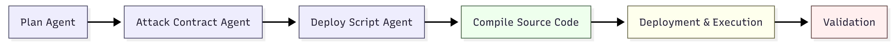

# AI Auditor

An AI-powered backend service that automatically exploits [Ethernaut](https://ethernaut.openzeppelin.com/) CTF challenges. It uses a multi-agent LLM pipeline to analyze vulnerable smart contracts, generate Solidity exploit code, and execute attacks against a local Anvil devnet — end to end, with no human intervention.



## How It Works

The service runs a **6-stage sequential pipeline** for each Ethernaut level:

| Stage | Component | Description |
|-------|-----------|-------------|
| 1 | **Plan Agent** | Analyzes the target contract and factory validation logic. Identifies the vulnerability class and produces a structured attack plan with precise code-generation instructions. |
| 2 | **Attack Contract Agent** | Takes the plan + level context and generates a minimal Solidity exploit contract. Prefers constructor-based attacks (deploy = exploit). |
| 3 | **Deploy Script Agent** | Generates a Foundry Script (`forge script`) that deploys the attack contract and performs any post-deployment calls needed to complete the exploit. |
| 4 | **Compile** | Writes the generated Solidity to a sandboxed Foundry project (`work-dir/compiler-env/`) and runs `forge build`. |
| 5 | **Execute** | Runs the deploy script via `forge script --broadcast` against the local Anvil blockchain. |
| 6 | **Validate** | Submits the exploited instance back to the Ethernaut contract and checks if `LevelCompletedLog` was emitted. |

All three LLM agents (Plan, Attack Contract, Deploy Script) are LangChain `RunnableSequence` chains. The model is configurable — currently supports **OpenAI** (GPT) and **Anthropic** (Claude) via LangChain adapters.

### ReAct Agent (Alternative Mode)

In addition to the linear pipeline, there is also a **ReAct tool-calling agent** (`level-player`) that can autonomously interact with the blockchain in a loop: write contracts, compile, deploy, send transactions, and read state — iterating until the exploit succeeds. This agent has access to 5 blockchain tools:

- `write_attack_contract` — Write Solidity files to the compiler workspace
- `compile_contract` — Run `forge build` and check for artifacts
- `deploy_contract` — Deploy compiled contracts via ethers.js
- `send_transaction` — Call contract functions or send ETH
- `read_blockchain` — Read balances, storage slots, or call view functions

## Prerequisites

- **Node.js** >= 18
- **Foundry** (forge, anvil) — [install guide](https://book.getfoundry.sh/getting-started/installation)
- **Anvil** running locally with Ethernaut deployed
- An LLM API key (OpenAI or Anthropic)

## Setup

```bash
# Install dependencies
npm install

# Initialize the Foundry submodule (for the compiler workspace)
git submodule update --init --recursive

# Create .env file
cp .env.example .env
# Add your API key:
#   OPENAI_API_KEY=sk-...       (for OpenAI models)
#   ANTHROPIC_API_KEY=sk-ant-...  (for Anthropic models)
```

Configure the model provider and name in `src/config.ts`:

```typescript
MODEL_PROVIDER: "anthropic",       // "openai" | "anthropic"
MODEL_NAME: "claude-opus-4-6",  // or "gpt-5-mini", etc.
```

## Running

```bash
# Start the server (default: port 3001)
npm run dev
```

## API Endpoints

### `GET /context/:levelId`

Returns the assembled context for a level (contract sources, docs, deployment addresses) without executing anything. Useful for debugging prompts.

```bash
curl http://localhost:3001/context/1
```

### `POST /init-level/:levelId`

Creates a new level instance on-chain via the Ethernaut factory. Returns the instance address.

```bash
curl -X POST http://localhost:3001/init-level/1
```

### `POST /play-level/:levelId`

Runs the full pipeline: plan, generate contract, compile, create instance, generate deploy script, execute, and validate. Returns a detailed result object with every intermediate artifact.

```bash
curl -X POST http://localhost:3001/play-level/1
```

**Response shape:**
```json
{
  "levelName": "Fallback",
  "levelId": "1",
  "plan": "## SUCCESS CONDITION ...",
  "contractCode": "// SPDX-License-Identifier ...",
  "compilation": { "success": true },
  "instanceAddress": "0x...",
  "deployScript": "// SPDX-License-Identifier ...",
  "execution": { "success": true },
  "submitted": true
}
```

### `POST /compile`

Standalone compilation endpoint. Writes provided Solidity source to the compiler workspace and runs `forge build`.

```bash
curl -X POST http://localhost:3001/compile \
  -H "Content-Type: application/json" \
  -d '{"sourceCode": "// SPDX-License-Identifier: MIT\npragma solidity ^0.8.0;\ncontract Foo {}"}'
```

## Project Structure

```
ai-auditor/
├── src/
│   ├── server.ts                  # Express API server
│   ├── config.ts                  # All configuration (RPC, paths, model, etc.)
│   ├── types.ts                   # Shared TypeScript types
│   ├── agents/
│   │   ├── model.ts               # LLM factory (OpenAI / Anthropic)
│   │   ├── attack-planer.ts       # Stage 1: vulnerability analysis + attack plan
│   │   ├── attack-contract.ts     # Stage 2: Solidity exploit generation
│   │   ├── deploy-script.ts       # Stage 3: Foundry deploy script generation
│   │   ├── level-player.ts        # ReAct agent with tool-calling loop
│   │   └── json.ts                # JSON-structured output agent (OpenAI fn calling)
│   ├── services/
│   │   ├── playerService.ts       # Orchestrates the full 6-stage pipeline
│   │   ├── contextAssembler.ts    # Assembles level context from game data
│   │   └── levelInstanceManager.ts # Creates/submits level instances on-chain
│   ├── tools/
│   │   ├── index.ts               # Game data tool exports
│   │   ├── getLevelInfo.ts        # Level metadata lookup
│   │   ├── getContractSource.ts   # Solidity source retrieval
│   │   ├── getLevelDocs.ts        # Level documentation/hints
│   │   ├── getDeploymentAddress.ts # On-chain address lookup
│   │   └── blockchain/
│   │       ├── writeAttackContract.ts  # Write .sol files
│   │       ├── compileContract.ts      # forge build wrapper
│   │       ├── deployContract.ts       # ethers.js deployment
│   │       ├── sendTransaction.ts      # Contract calls / ETH transfers
│   │       └── readBlockchain.ts       # Balance, storage, view calls
│   └── game-data/ethernaut/
│       ├── gamedata.json          # Level metadata (name, difficulty, contracts)
│       ├── deploy.local.json      # Local Anvil deployment addresses
│       ├── contracts/             # Solidity sources for all levels
│       └── docs/                  # Level descriptions and completion hints
└── work-dir/compiler-env/         # Sandboxed Foundry project for compilation
    ├── src/                       # Agent-written attack contracts go here
    ├── script/                    # Agent-written deploy scripts go here
    └── lib/forge-std/             # Forge standard library (git submodule)
```

## Tech Stack

- **TypeScript** + **Express** — API server
- **LangChain** — LLM orchestration (prompts, chains, agents, tools)
- **ethers.js v6** — Blockchain interaction (deploy, transact, read)
- **Foundry** (forge) — Solidity compilation and script execution
- **Zod** — Schema validation for tool inputs
